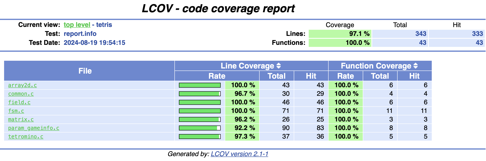
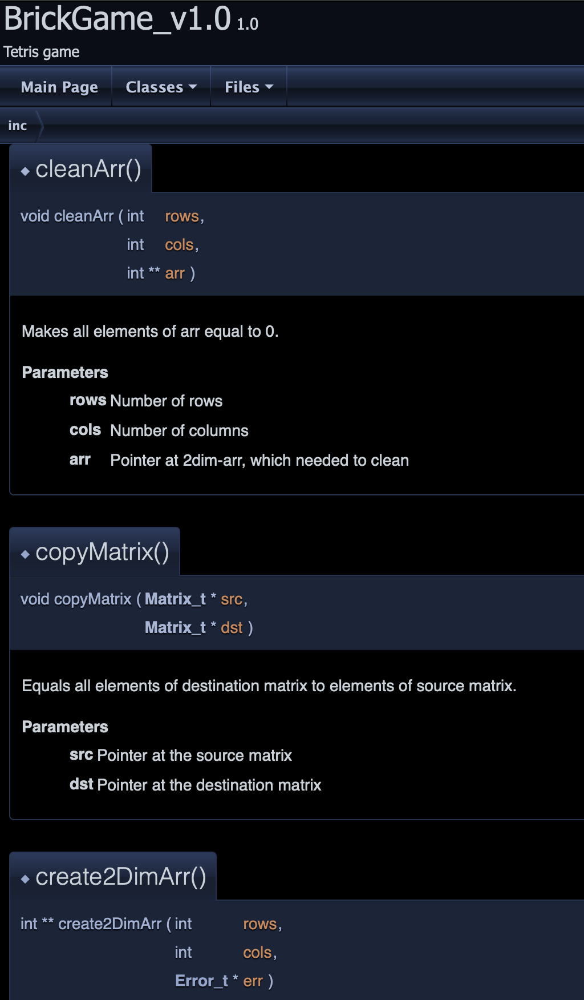
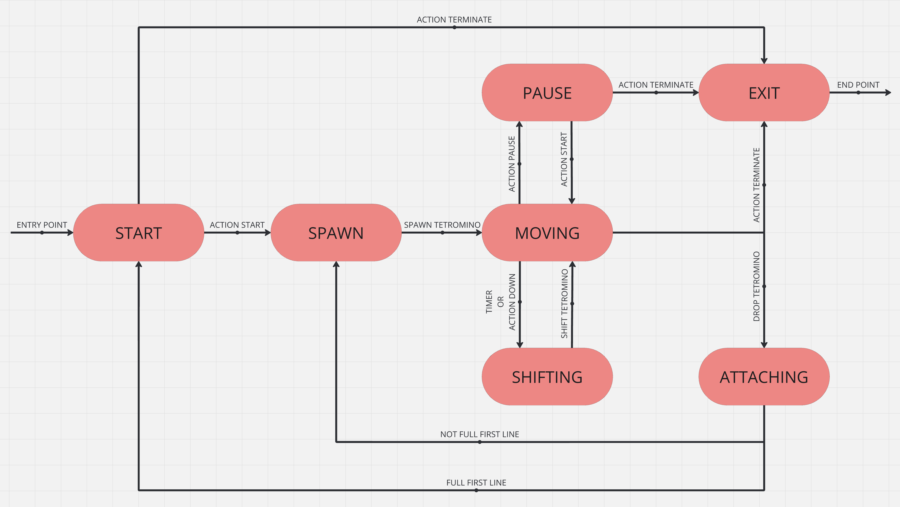

## 🧩 GameTetris

### The GameTetris is a terminal-version of the popular russian game "Tetris"
🚀 Developed in a structured programming style in pure C language.

### 🏁 Start the Game

* To start the game - use `make install` and after `make start`.

### 🕹️ Game controls

* <- | -> to move the tetromino
     v
* "Enter" - start the game
* "p" - pause
* "Space" - rotate the tetromino
* "Esc" - exit the game

### ℹ️ Info

* Coverage 97% by Unit tests (You also can check it by `make test` and `make gcov-report`)

 

* Documentation done with Doxyfile (`make dvi`)

* Realized with principle of finite state machine
  

* Implementation backend and frontend parts separately
  
* Loading and saving record in invisible file

* All 7 types color tetromino

* Information about game over and the ability to restart the game

